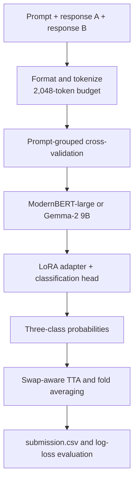

# LLM Preference Classification Fine-Tuning

[](https://github.com/sarthak11jain/LLM-Preference-Classification-Fine-Tuning-/actions/workflows/quality.yml)
[](pyproject.toml)
[](LICENSE)
[](https://www.kaggle.com/competitions/llm-classification-finetuning)

Parameter-efficient fine-tuning for predicting which of two chatbot responses human annotators prefer. This repository is the public, reproducible companion to my work on [Kaggle's LLM Classification Finetuning competition](https://www.kaggle.com/competitions/llm-classification-finetuning).

The task is a three-class probability prediction problem. Each row contains a `prompt`, `response_a`, and `response_b`; the model predicts:

```text
winner_model_a | winner_model_b | winner_tie
```

The metric is multiclass log loss, so calibrated probabilities matter more than simply selecting a hard winner.

## Project highlights

| Area | Implementation | Outcome |
|---|---|---|
| Preference modeling | Cross-encoder-style three-way classifier | Predicts calibrated A-win, B-win, and tie probabilities |
| Primary backbones | Gemma-2 9B and ModernBERT-large | Decoder and encoder workflows are both documented |
| Parameter efficiency | LoRA adapters with trainable classification heads | Makes large-model fine-tuning practical on external GPU infrastructure |
| Generalization | Prompt-grouped CV, response swaps, swap-aware TTA, fold averaging | Reduces prompt leakage and response-position bias |
| Evaluation | Multiclass log loss with explicit evidence scope | Separates local validation from public leaderboard results |

## Current project state

The two primary modeling tracks are:

```text
ModernBERT-large + LoRA + grouped CV + response-order augmentation + swap TTA
Gemma-2 9B      + LoRA + grouped CV + response-order augmentation + swap TTA
```

Both are first-class workflows. The public package contains reusable implementation; notebooks preserve readable GPU/Kaggle experiment records. Competition data, gated model weights, adapters, and credentials are supplied by the user at runtime rather than distributed here.

## CV-ready project description

These are the project bullets supported by repository evidence:

- Engineered an LLM preference-ranking system for Kaggle, predicting three-way human choices from paired chatbot responses.
- Fine-tuned Gemma-2 9B and ModernBERT-large with LoRA, grouped CV, label smoothing, and 2K inputs for preference ranking.
- Strengthened generalization with response-order augmentation, swap-aware TTA, fold ensembling, and probability averaging.
- Recorded 0.99655 validation log loss with Gemma-2 9B, outperforming the 1.01218 ModernBERT LoRA baseline on the same split.

The precise provenance of every bullet is documented in [`docs/cv-provenance.md`](docs/cv-provenance.md).

## Verified results

| Experiment | Log loss | Scope | Evidence status |
|---|---:|---|---|
| Constant probability baseline | 1.09794 | Kaggle public leaderboard | Recorded in source project audit |
| TF-IDF logistic regression | 1.11052 | Local validation | Recorded in source project audit |
| ModernBERT frozen classifier head | 1.07855 | Kaggle public leaderboard | Verified from submission history |
| ModernBERT-large LoRA, fold 1 | 1.01218 | Local validation, fold 1 | Verified from CLI-pulled metrics |
| ModernBERT-large LoRA, fold-1 inference | 1.01474 | Kaggle public leaderboard | Verified from submission history |
| ModernBERT-large LoRA, three-fold inference | 1.01414 | Kaggle public leaderboard | Verified from submission history |
| Gemma-2 9B LoRA | 0.99655 | Local validation, fold 1, 2,048-token input | Verified from metric artifact |

The local values are not leaderboard scores. The Gemma value is a fold-1 validation result, not a completed three-fold aggregate. The public ModernBERT scores are separate inference submissions.

## Method



During training, swapping the two responses also swaps the A/B labels. During inference, swapped predictions are remapped with `[1, 0, 2]` before averaging.

## Model training

The training design has four controls that directly support the CV claims:

1. **Grouped folds:** prompts, rather than individual rows, define fold groups so repeated prompts cannot cross the validation boundary.
2. **Response-order augmentation:** each labeled example is duplicated with responses A and B exchanged, including the corresponding A/B labels.
3. **LoRA fine-tuning:** the base model stays mostly frozen while low-rank adapter weights and the classifier head learn the preference task.
4. **Swap-aware inference:** predictions from the swapped presentation are remapped from `[A, B, tie]` to `[B, A, tie]` before averaging.

The implementation is intentionally split into reusable CPU-safe components and
GPU-host notebooks. This keeps the logic testable without requiring the
competition dataset or a gated model download.

## Repository structure

```text
.
├── .github/workflows/       CI quality checks
├── configs/                 ModernBERT and Gemma experiment templates
├── docs/                    architecture, data, provenance, and workflows
├── evidence/                small non-sensitive metric artifacts
├── experiments/             result tables and artifact inventory
├── notebooks/               readable GPU/Kaggle experiment records
├── scripts/                 public repository audit utilities
├── src/preference_classifier/
│   ├── baselines.py         constant and TF-IDF reference baselines
│   ├── data.py              schema and label handling
│   ├── augmentation.py      response swaps and label remapping
│   ├── preprocessing.py     formatting and token-budget helpers
│   ├── splits.py            prompt-grouped cross-validation
│   ├── models.py            lazy LoRA construction and model defaults
│   ├── training.py          loss, seeding, and OOF helpers
│   ├── inference.py         TTA and fold ensembling
│   ├── evaluation.py        log loss and probability validation
│   └── submission.py        competition submission formatting
├── tests/                   deterministic unit and API tests
├── CITATION.cff
├── CONTRIBUTING.md
├── LICENSE
├── pyproject.toml
└── README.md
```

Every serious experiment should have a readable notebook under `notebooks/` and a corresponding metric/provenance entry under `experiments/` or `evidence/`.

## Setup

```powershell
python -m venv .venv
.\\.venv\\Scripts\\Activate.ps1
python -m pip install --upgrade pip
python -m pip install -e ".[dev]"
python -m pytest -q
```

CPU-safe commands:

```powershell
python -m preference_classifier.cli demo-swap
python -m preference_classifier.cli validate-data --path path\\to\\train.csv
python -m preference_classifier.cli show-config --path configs\\gemma2_lora.example.yaml
python -m preference_classifier.cli make-constant-submission --path path\\to\\test.csv --output outputs\\constant_submission.csv
```

A test CSV needs `id`, `prompt`, `response_a`, and `response_b`. A training CSV additionally needs the three target columns. See [`docs/data-card.md`](docs/data-card.md).

## Reproduction tracks

### Baseline

Use the constant-probability and TF-IDF baselines to verify data loading, labels, probability formatting, and local evaluation before using a GPU.

### ModernBERT-large LoRA

Use [`configs/modernbert_lora.yaml`](configs/modernbert_lora.yaml) and the ModernBERT notebooks. The recorded workflow uses prompt-grouped folds, response swaps, LoRA, 2,048-token inputs, swap TTA, and fold probability averaging.

### Gemma-2 9B LoRA

Use [`configs/gemma2_lora.example.yaml`](configs/gemma2_lora.example.yaml) and [`notebooks/gemma2_lora_external_gpu_training.ipynb`](notebooks/gemma2_lora_external_gpu_training.ipynb). The recorded fold-1 artifact uses a 2,048-token budget and reports validation log loss `0.9965459017`.

### Kaggle/GPU execution

The notebooks are templates and evidence records. On Kaggle or another GPU host, attach permitted competition data, base models, and private adapters through that platform's normal interface. Then write `submission.csv` to the host's working directory. Do not place credentials, private dataset packages, or model weights in this repository.

See [`docs/public-workflow.md`](docs/public-workflow.md) and [`docs/kaggle-submission-audit.md`](docs/kaggle-submission-audit.md).

## Provenance and honest scope

The repository deliberately separates local validation from leaderboard scores. Every reported value has a source artifact, evaluation scope, and limitation in [`experiments/results.csv`](experiments/results.csv), [`evidence/`](evidence/), and [`docs/cv-provenance.md`](docs/cv-provenance.md).

Fresh runs may differ because of data versions, model revisions, seeds, GPU hardware, library versions, and private adapter artifacts. The repository justifies the engineering claims; it does not promise bitwise reproduction without the original runtime inputs.

## External references

- [Kaggle LLM Classification Finetuning](https://www.kaggle.com/competitions/llm-classification-finetuning)
- [Answer.AI ModernBERT-large](https://huggingface.co/answerdotai/ModernBERT-large)
- [Google Gemma-2 9B](https://huggingface.co/google/gemma-2-9b)
- [Hugging Face PEFT](https://huggingface.co/docs/peft)

The external Kaggle notebooks listed in [`docs/external-sources.md`](docs/external-sources.md) are methodological references only; their checkpoints and scores are not claimed as project results.

## Contribution and publication

See [`CONTRIBUTING.md`](CONTRIBUTING.md), [`SECURITY.md`](SECURITY.md), and [`docs/release-checklist.md`](docs/release-checklist.md). Run `python scripts/audit_public_repo.py` before publishing changes.
