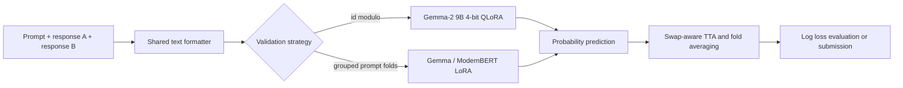

# LLM Preference Classification Fine-Tuning

[](https://github.com/sarthak11jain/LLM-Preference-Classification-Fine-Tuning-/actions/workflows/quality.yml)
[](pyproject.toml)
[](LICENSE)

A package-first implementation of three-way preference classification for
paired chatbot responses. Given a prompt and two candidate answers, the system
predicts whether response A wins, response B wins, or the annotators tie.

The primary workflow uses Gemma-2 9B with 4-bit PEFT QLoRA. ModernBERT-large
provides an encoder comparison. The competition metric is multiclass log loss,
so the system produces probabilities rather than only hard labels.

## Results

Scores are grouped by evaluation scope. The deterministic ID split and grouped
prompt split are separate experiments and should not be compared as equivalent
validation protocols.

### Local validation

| Model | Split | Rows | Folds | Train / inference length | TTA | Log loss |
|---|---|---:|---:|---:|---|---:|
| Gemma-2 9B 4-bit QLoRA | `id % 5 == 0` | 11,476 | 1 | 1,024 / 2,048 | No | **0.9371** |
| Gemma-2 9B LoRA | grouped prompt, fold 1 | 19,159 | 3 | 2,048 / 2,048 | Yes | 0.99655 |
| ModernBERT-large LoRA | grouped prompt, fold 1 | 19,159 | 3 | 2,048 / 2,048 | Yes | 1.01218 |
| ModernBERT-large LoRA | grouped prompt, folds 2–3 | 38,318 | 3 | 2,048 / 2,048 | Yes | 1.02492 |

### Public leaderboard

| Model | Inference setup | Log loss |
|---|---|---:|
| Gemma-2 9B 4-bit QLoRA | 2,048-token inference | **0.941** |
| ModernBERT-large LoRA | three-fold probability average with swap TTA | 1.01414 |
| ModernBERT frozen classifier head | single workflow | 1.07855 |
| Uniform constant prior | reference baseline | 1.09794 |

The controlled ablation table is stored in
[`experiments/ablation.csv`](experiments/ablation.csv). It currently contains
only the schema; new rows are added after controlled runs are completed.

## Method



The training code supports:

- response-order augmentation with A/B label remapping;
- prompt-grouped folds to prevent repeated prompts crossing a fold boundary;
- deterministic `id % 5 == 0` evaluation for the primary Gemma result;
- 1,024-token training and 2,048-token inference budgets;
- LoRA/QLoRA adapters with configurable target modules;
- probability-level TTA and fold ensembling;
- reliability, ECE, and Brier-score analysis when predictions are available.

The repository describes probability prediction as log-loss optimized until
OOF calibration results are available. The committed calibration files are
CPU demo artifacts, not Gemma evaluation claims.

## Quickstart

```powershell
python -m venv .venv
.\.venv\Scripts\Activate.ps1
python -m pip install -r requirements-dev.lock
python -m pip install -e .
python -m preference_classifier.cli demo --output-dir outputs/demo
python -m pytest -q
```

The CPU demo uses synthetic data and writes a uniform-prior sample submission,
validation metrics, calibration metrics, and a reliability diagram. It does not
download competition data or model weights.

Useful commands:

```powershell
python -m preference_classifier.cli show-config --path configs\gemma2_qlora_id_mod5.yaml
python -m preference_classifier.cli validate-data --path path\to\train.csv
python -m preference_classifier.cli make-constant-submission --path path\to\test.csv --output outputs\constant.csv
python -m preference_classifier.cli train --config configs\demo_cpu.yaml --train data\demo\train.csv --output-dir outputs\tfidf --backend tfidf
python -m preference_classifier.cli evaluate --labels data\demo\validation.csv --predictions data\demo\validation_predictions.csv
```

## GPU workflows

Install the pinned GPU environment from
[`requirements-gpu.lock`](requirements-gpu.lock), then provide the competition
CSV and permitted model weights at runtime:

```powershell
python -m pip install -r requirements-gpu.lock
python -m pip install -e .
python -m preference_classifier.cli train --config configs\gemma2_grouped_qlora.yaml --train path\to\train.csv --output-dir outputs\gemma2_grouped
python -m preference_classifier.cli predict --config configs\gemma2_qlora_id_mod5.yaml --test path\to\test.csv --checkpoint outputs\gemma2_grouped\fold_1 --output outputs\submission.csv --backend transformer
```

Gemma-2 fine-tuning is GPU-only in practice and may require gated model access,
4-bit support, and substantial VRAM. The notebooks in [`notebooks/`](notebooks/)
are concise runtime entrypoints; the implementation lives in
[`src/preference_classifier/`](src/preference_classifier/).

## Repository layout

```text
configs/                         reproducible experiment configurations
data/demo/                       synthetic CPU-safe demonstration data
docs/                            architecture, data, runtime, and release notes
experiments/                     scope-separated result records and ablation schema
metrics/                         compact records for completed experiments
notebooks/                       thin Gemma and ModernBERT runtime entrypoints
reports/                         generated demo analysis outputs
scripts/                         repository audit and maintenance utilities
src/preference_classifier/       reusable data, model, training, evaluation code
tests/                           unit, CLI, calibration, and smoke tests
requirements-*.lock             pinned CPU, GPU, and development environments
```

## Reproducibility and data

Competition data, gated weights, trained adapters, and credentials are not
stored in this public repository. Input schemas and runtime expectations are
documented in [`docs/data-card.md`](docs/data-card.md) and
[`docs/kaggle.md`](docs/kaggle.md). Experiment records link each score to its
configuration and metric artifact.

## References

- [Kaggle LLM Classification Finetuning](https://www.kaggle.com/competitions/llm-classification-finetuning)
- [Google Gemma](https://huggingface.co/google/gemma-2-9b)
- [Answer.AI ModernBERT-large](https://huggingface.co/answerdotai/ModernBERT-large)
- [Hugging Face PEFT](https://huggingface.co/docs/peft)

See [`CONTRIBUTING.md`](CONTRIBUTING.md), [`SECURITY.md`](SECURITY.md), and
[`docs/release-checklist.md`](docs/release-checklist.md) before publishing
changes.
